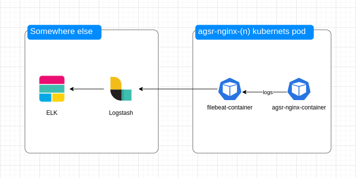

# Coding challenge from AGSR

## Project map

```bash

├── charts
│   └── agsr-nginx
│       ├── Chart.yaml
│       ├── templates
│       │   ├── configmap.yaml
│       │   ├── deployment.yaml
│       │   ├── namespace.yaml
│       │   └── service.yaml
│       └── values.yaml
├── nginx
│   ├── Dockerfile
│   └── nginx.conf
├── README.md
└── script
    └── sc.sh
```

## N.B

Since the task conditions do not mandate deploying on Kubernetes the Docker image created in the initial stage, the Docker image and deployments to Kubernetes are independent of each other.

## Checklist for AGSK folks

1. To check the first item of the task go to the file [nginx.conf](./nginx/nginx.conf)
2. To check the second item of the task go to the file [Dockerfile](./nginx/Dockerfile)
3. To check the third item of the task go to the folder [charts](./charts/)
4. To check the fourth item of the task go to the file [sc.sh](./script/sc.sh). Use image tag as a first script argument.
5. "-"
6. We can enable logging in nginx settings and send them to ELK via filebeat and logstash. Additionally we can use Synthetic monitoring from ELK



## Useful commands

```bash
# Forward port to check result
kubectl port-forward <pod name> <port on your pc>:80 -n agsr-nginx
```

## Task conditions

[2024.01.03 - devops test task.pdf](./2024.01.03%20-%20devops%20test%20task.pdf)
